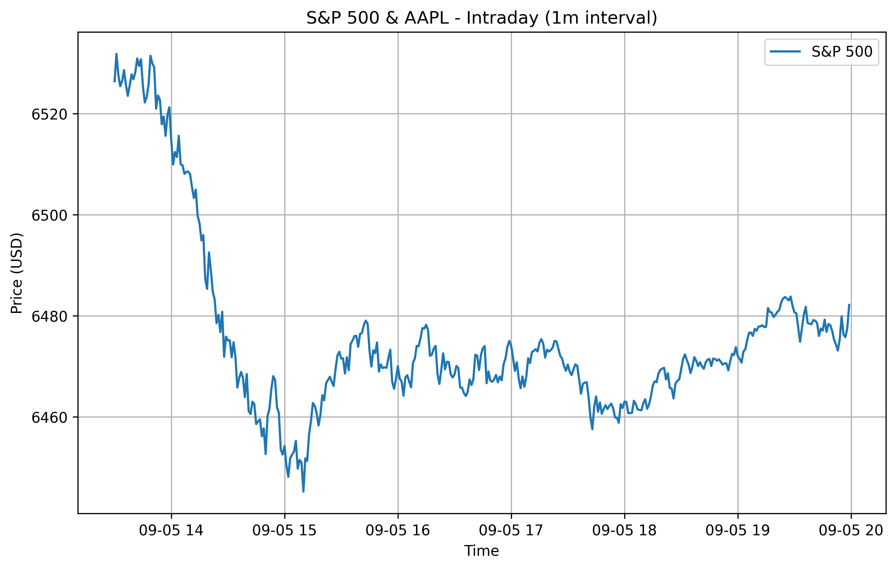

<link rel="stylesheet" href="assets/css/style.css">

## 🥇 Featured Project: compound interest calculator

a easy-to-use Python tool that calculates compound interest over time,
with options for regular contributions and different compounding frequencies.

it also plots the growth of the investment over time using matplotlib.

### 🔧 Tools Use
- **Python**: pandas, numpy, matplotlib
- **Visualization**: matplotlib / plotly

### 🔧 Tools Used
- **Python**: pandas, numpy, matplotlib
- **Market Data**: [yfinance](https://pypi.org/project/yfinance/)
- **Visualization**: matplotlib / plotly

### 📈 Key Features
- Import daily stock/crypto prices
- Calculate portfolio returns, volatility, Sharpe ratio
- Compare vs. S&P 500 performance
- Visualize cumulative growth over time

### 📊 S&P500 daily

Here’s a sample plot of my portfolio compared to the S&P 500 index.

👉 [Click here for the interactive chart](portfolio_tracker_chart.html)

---

## 🚀 Upcoming Projects
- **Options Payoff Visualizer**: Plot payoff diagrams for calls/puts and strategies.  
- **Monte Carlo VaR**: Simulate portfolio losses and calculate Value-at-Risk.  
- **Backtesting Framework**: Test trading strategies on historical data.  

---

## 🧑‍💻 About Me
I’m learning **Python for Finance** with the goal of moving into quantitative analysis and trading systems.  
Check out my [GitHub profile](https://github.com/your-username) for source code!

